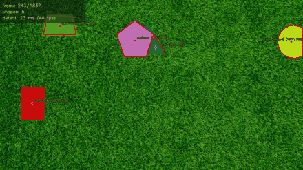
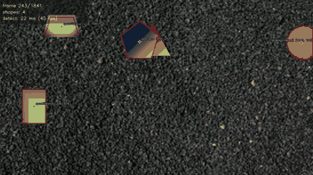
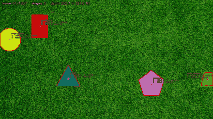
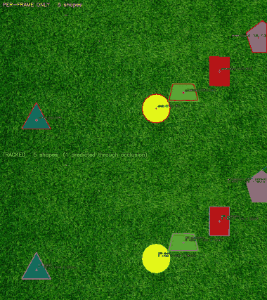

# PennAiR Software Challenge — Shape Detection

Detects solid shapes on a textured background, traces their outlines, locates
their centers in 2D and 3D, tracks them through occlusion, and publishes the
results over ROS 2.

All six parts are implemented and measured. Every number below came from
sweeping the full clips, not from picking good frames.

| Part | Status | Headline result |
|---|---|---|
| 1 — Static image | done | 5/5 shapes, outlines and centers |
| 2 — Video (streamed) | done | **38.7 fps** detection vs a 30.3 fps source |
| 3 — Background agnostic | done | Same code, same parameters, zero tuning |
| 4 — 3D coordinates | done | Depth constant to **0.66%** over 1214 frames |
| 5 — ROS 2 | done | `/camera/shapes` at **30.7 Hz**, verified running |
| 6 — Tracking | done | All-5 rate **59.6% → 68.5%**, label flicker **−73%** |

---

## Demos

**Part 2 — grass** · [full video](output/part2_dynamic_annotated.mp4)



**Part 3 — asphalt with gradient fills.** Same algorithm, same parameters, only
the input path changed · [full video](output/part3_hard_annotated.mp4)



**Part 4 — 3D centers in inches** · [full video](output/part4_3d_annotated.mp4)



**Part 6 — per-frame (top) vs tracked (bottom).** Watch the shapes that vanish
on top survive on the bottom · [full video](output/part6_tracking_comparison.mp4)



---

## Setup

```bash
python3 -m venv .venv
source .venv/bin/activate
pip install -r requirements.txt
```

Video assets are stored with Git LFS. After cloning:

```bash
git lfs install && git lfs pull
```

---

## The core idea

Backgrounds get removed by *texture*, never by colour.

Keying on green would pass Part 1 and fail Part 3 immediately, so the detector
never names a colour. What separates a target from the ground is that targets
are **smooth** and natural ground cover is **visually busy**.

The measure of "busy" is the local mean of `|Laplacian|` — high-frequency
energy. The Laplacian is a *second* derivative, so a smooth ramp differentiates
to exactly zero while random grain lights it up. That distinction is the whole
algorithm: not *how much* does this region vary, but does it vary **smoothly or
randomly**. It is what lets one threshold handle grass, asphalt, and
gradient-filled shapes at once.

The pipeline:

1. **Busyness map** — local mean of `|Laplacian|`, averaged across BGR.
2. **Adaptive threshold** — smooth if busyness `< 0.35 × median(busyness)`.
   Using the frame's own median is what makes it background agnostic; nothing is
   hard-coded about any particular ground.
3. **Gentle morphology** — open to drop speckle, close *lightly*. Where two
   shapes touch, the colour step between them is the only thing separating them,
   and heavy closing destroys it.
4. **Colour refinement** — the busyness window insets the mask by about half its
   width, so each blob is re-grown to its true edge, each pixel judged against
   its **nearest seed pixel** rather than a global average, which is what lets a
   magenta→green gradient be followed instead of cut in half.
5. **Filter and measure** — area and solidity gates, then centers from image
   moments.

Detection runs on a 960px-wide copy (the mask only needs to say *where* shapes
are) while refinement runs at full resolution inside small ROIs, so nothing is
given up on outline precision.

---

## Part 1 — Static image

```bash
python src/part1_static.py
```

All 5 shapes, each classified from its vertex count:

| Shape | Center | Area (px²) |
|---|---|---|
| pentagon | (690, 344) | 8799 |
| quadrilateral | (839, 148) | 5630 |
| triangle | (279, 320) | 5602 |
| circle | (553, 104) | 5119 |
| quadrilateral | (112, 76) | 3562 |

**Otsu thresholding does not work here** and was the first thing to go. The
background dominates the histogram, so Otsu splits *grass vs shape-edges*
instead of *background vs shapes* and marks the entire frame smooth — zero
detections. A threshold relative to the frame's own median works because it
measures the background rather than being fooled by it.

---

## Part 2 — Video (streamed)

```bash
python src/part2_video.py                  # -> output/part2_dynamic_annotated.mp4
python src/part2_video.py --show           # live preview
```

The video is treated as a **stream**, as required: read one frame, detect, write,
forget. Nothing looks ahead, buffers the clip, or makes a second pass.

| Stage | Rate |
|---|---|
| Detection only | **38.7 fps** (25.9 ms/frame) |
| End-to-end (decode + detect + draw + encode) | **33.8 fps** |
| Source | 30.3 fps |

Getting there from an initial 10–20 fps: analyse at reduced resolution, compute
variance with box filters (O(1) per pixel regardless of window size), and bound
the per-shape refinement.

Three accuracy bugs, all found by sweeping the clip rather than eyeballing:

- **Overlapping shapes merged.** `CLOSE(15×15, ×2)` was welding the pentagon to
  the trapezoid beneath it. Reduced to a single `CLOSE(7×7)`.
- **Refinement flooded its ROI.** A green shape on green grass cannot be
  separated by colour at all. Fixed by leashing growth to a band around the
  seed: texture decides *where* the shape is, colour only *sharpens the edge*.
- **Triangles read as pentagons.** A rounded corner makes `approxPolyDP` emit
  two or three vertices a few pixels apart. Fixed by fusing vertices closer than
  8% of the perimeter.

---

## Part 3 — Background agnostic

```bash
python src/part2_video.py \
    --video "assets/PennAir 2024 App Dynamic Hard.mp4" \
    --out   output/part3_hard_annotated.mp4
```

**Same script, same parameters, no tuning.** Only the input path changes.

### Local standard deviation cannot see gradients

The original metric failed completely on gradient fills:

| Region | local std |
|---|---|
| asphalt background | 11.67 |
| rectangle, magenta end | 11.83 |
| triangle (gradient) | 11.42 |
| rectangle, flat green end | 0.00 |

The gradients are *exactly as variable* as the asphalt, so only flat regions
survived — half a circle, half a pentagon, no triangle. Switching to
`|Laplacian|` energy fixed it, scored against a hand-built ground-truth mask:

| Metric | Youden's J |
|---|---|
| local std (old) | 0.571 |
| high-pass `\|I − G(σ=1)\|` | 0.986 |
| **local mean of `\|Laplacian\|`** | **0.997** |

*(The ground truth was built by thresholding saturation — a measuring stick
only, deliberately **not** part of the algorithm, since it would defeat the
point.)*

### Averaging channels, not maxing them

The magenta half of the rectangle is a *constant* colour, `[146,53,159]`, yet
still measured above threshold: chroma is subsampled in compressed video, so a
saturated flat fill carries real chroma noise, and `max` across BGR let that
noise speak for the whole pixel.

| Channel reduction | recall | false positives |
|---|---|---|
| max | 0.922 | 0.0017 |
| **mean** | **0.997** | 0.0019 |
| grayscale | 0.999 | 0.0021 |

Grayscale scores marginally higher and is cheaper, but goes blind to a shape
differing from its background only in hue — precisely the case this part exists
to test — so `mean` is the better trade.

### Refinement was destroying detections

The new metric initially made the *grass* clip worse (60.3% → 51.6%). The green
trapezoid on green grass was found, refined into a ragged blob with solidity
0.841, and thrown out by the 0.85 gate. The refinement made the shape worse and
the filter then killed it.

Fixed with a rule that generalises the earlier guard: **refinement may only
improve a blob.** If it shrinks the region or materially drops its solidity,
keep the seed. Falling back costs a few pixels of inset; accepting a bad
refinement costs the whole detection.

---

## Part 4 — 3D coordinates

```bash
python src/part4_3d.py
python src/part4_3d.py --image "assets/PennAir 2024 App Static.png" \
                       --out output/part4_static_3d.png
python src/part4_3d.py --literal-principal-point
```

Centers are reported as (X, Y, Z) in inches, OpenCV convention: +X right,
+Y **down**, +Z along the optical axis.

A circle of radius R at depth Z covers `π·fx·fy·R²/Z²` pixels, so

```
Z = R · sqrt(pi · fx · fy / area_px)
```

Area beats a measured radius because it integrates over the whole blob instead
of hanging on a few ragged boundary pixels. The circle fixes Z; the flat-surface
assumption extends it to every shape; X and Y follow by backprojection.

### Two judgement calls

**Which resolution K belongs to.** Focal lengths are in pixels, so they are tied
to their calibration resolution, and the static image is half the video's size.
Against 1920×1080 this K implies a 41.0° × 23.7° field of view — an ordinary
camera. Against 960×540 it implies 21.2° × 12.0°, an improbable telephoto. So K
belongs to the video and is rescaled for the static image; skipping this would
put the static depth out by exactly 2×.

**The principal point.** The supplied K has `cx = cy = 0`, which places the
optical axis at the top-left *corner* of the sensor. No real camera is built
that way, and a calibration returning that for a 1920×1080 frame would be
rejected as broken — it reads as a placeholder rather than a measurement. The
image center is substituted by default, the standard assumption for an
uncalibrated principal point. This shifts the origin of X and Y only; **depth is
unaffected either way.** `--literal-principal-point` uses K exactly as written.

### Testing the flat-surface assumption

Estimated independently on every frame where the circle is fully visible
(1214 of 1837):

| | inches |
|---|---|
| median depth | 252.2 (21.0 ft) |
| standard deviation | 1.66 |
| spread | **0.66% of mean** |

Constant to under a percent, so the assumption holds. The residual is almost
entirely 10 frames (0.82%) where the circle is partly occluded — less visible
area reads as a smaller circle and therefore a falsely *larger* depth. Excluding
those, spread drops to **0.19%**.

Hence a running median rather than a per-frame value: it rejects those spikes
and keeps depth available on the 34% of frames with no circle in shot.

---

## Part 5 — ROS 2

ROS 2 Jazzy, containerised so it runs anywhere (macOS included) without a VM.

```bash
./ros2_ws/run_docker.sh          # build image + workspace, then launch
./ros2_ws/run_docker.sh shell    # interactive shell in the container
```

```
video_publisher ──/camera/image_raw──▶ shape_detector ──┬──▶ /camera/shapes
 (one frame per tick)                                   └──▶ /camera/image_annotated
```

| Package | Build type | Contents |
|---|---|---|
| `pennair_vision_msgs` | `ament_cmake` | `Shape.msg`, `ShapeArray.msg` |
| `pennair_vision` | `ament_python` | both nodes, launch file |

Two packages because `ament_python` cannot generate messages — interface
generation requires `ament_cmake`.

The detector node **imports `src/detector.py` directly** rather than carrying a
copy, so the ROS graph and the standalone scripts run literally the same
algorithm, with no second implementation to drift.

Verified running in the container:

```
$ ros2 topic type /camera/shapes
pennair_vision_msgs/msg/ShapeArray

$ ros2 topic hz /camera/shapes
average rate: 30.729          # source is 30.3 fps -> keeping up, no backlog
```

It reports the same 252.2 in depth as the standalone script.
`output/part5_ros2_topic_frame.png` was captured off `/camera/image_annotated`
as proof the graph really carries the data.

---

## Part 6 — Tracking through occlusion

```bash
python src/part6_tracking.py --compare     # stacked before/after
python src/part6_tracking.py --video "assets/PennAir 2024 App Dynamic Hard.mp4" \
                             --out output/part6_hard_tracked.mp4
```

Per-frame detection is memoryless, and it shows whenever shapes overlap: a shape
drops out for a few frames, its centre jumps to the centroid of the visible
sliver, and its label flickers. All three have one root cause — **a single frame
does not contain enough information to describe an occluded object, but earlier
frames do.**

- Tracks are matched to detections by predicted position, nearest first.
- An unmatched track **coasts** on a constant-velocity estimate for a few frames
  rather than being dropped, carrying its last known outline.
- A detection whose area has collapsed relative to the track's established size
  is treated as **partially occluded**: centre and outline come from the motion
  model, not from the truncated blob.
- Labels are a **majority vote** over recent unoccluded frames.

| | grass | asphalt |
|---|---|---|
| All 5 shapes, per-frame | 59.6% | 60.7% |
| All 5 shapes, **tracked** | **68.5%** | **69.4%** |
| Label changes, per-frame | 402 | 540 |
| Label changes, **tracked** | **108** | **125** |
| Phantom (>5 reported) — cost of coasting | 2.0% | 2.6% |

Still real-time at 31–35 fps end-to-end.

### Two rules that were tried, measured, and removed

Recorded so they do not get re-invented:

- **Suppress a coasting track overlapping a visible one.** Sounds like duplicate
  removal, but a shape hidden *behind* another **is** a coasting track
  overlapping a visible one, so it deletes precisely the tracks worth keeping.
  All-5 fell to 56%, below the untracked baseline.
- **Retire tracks last seen touching the border**, on the theory that a shape at
  the edge is leaving rather than hiding. Sweeping the leash from 2 to 12 frames
  left the phantom rate pinned at 2.7% while all-5 climbed steadily — the rule
  cost accuracy and bought nothing.

Duplicates are instead prevented at association time by widening the gate while
a track coasts, plus a strict footprint test (bbox IoU > 0.6): merely
overlapping is not evidence of duplication, but near-identical footprints are.
That trade — 0.3% of all-5 for 0.7% fewer phantoms — is worth it for a landing
system, where reporting a marker that is not there is worse than briefly missing
one that is.

---

## Known limitations

- **Low-contrast shapes keep a slightly inset outline.** The white trapezoid on
  grey asphalt has no colour contrast to grow toward, so refinement correctly
  declines and the outline sits a few pixels inside the true edge. Detection and
  centre are unaffected.
- **Phantom shapes ~2% of frames.** The cost of coasting through occlusion,
  tuned as described above.
- **The texture assumption has a limit.** It requires the background to be
  busier than the targets. A target sitting on a perfectly smooth surface — a
  painted floor, still water — would invert the assumption and need a
  complementary colour-region path.
- **Depth relies on the circle.** If no circle is ever visible, no absolute
  scale is available. Relative positions still work; absolute ones do not.

---

## Layout

```
assets/    input image and videos (Git LFS)
src/       detector.py     core algorithm
           camera.py       pinhole model, K handling
           tracker.py      multi-object tracking
           part1_static.py part2_video.py part4_3d.py part6_tracking.py
           make_previews.py
ros2_ws/   ROS 2 workspace + Dockerfile
output/    generated images and videos
docs/      README preview GIFs
```
